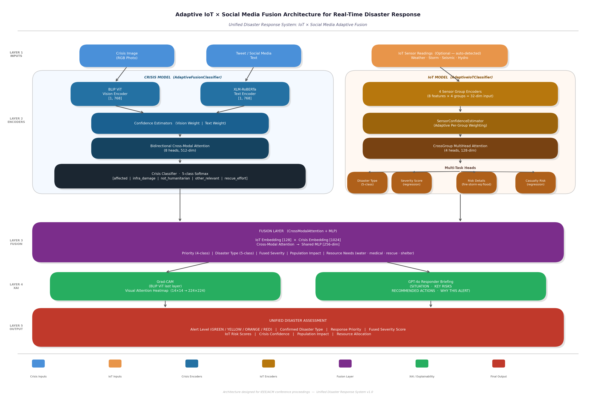

# Multimodal Disaster Intelligence Platform

A real-time disaster assessment system that fuses **IoT sensor data**, **social media (image + text)**, and **satellite imagery** through a learned tri-modal cross-attention mechanism. The system automatically detects disaster type, estimates severity, predicts resource needs, and generates explainable briefings for first responders -- no manual disaster-type input required.



## Key Features

- **Tri-Modal Fusion**: Combines IoT sensors, crisis social media, and satellite imagery via pairwise cross-attention with learned gating
- **Zero-Input Disaster Detection**: Automatically infers disaster type (fire, storm, earthquake, flood) from raw signals
- **Graceful Modality Degradation**: Operates with any subset of data streams without retraining -- 30% modality dropout during training enables robust missing-modality handling
- **Explainability (XAI)**: Gradient-weighted attention rollout (Grad-CAM) + GPT-4o natural language briefings
- **Alert & Resource Recommendation**: Automated alert levels (RED/ORANGE/YELLOW/GREEN) and resource allocation (water, medical, rescue, shelter)

## Architecture Overview

```
Layer 1: IoT Sensor Analysis
    32-dim sensor vector -> AdaptiveIoTClassifier -> disaster type + severity + risk scores
                                                      |
                                                      | 128-dim embedding
                                                      v
Layer 3: Tri-Modal Fusion ---------> TriFusionLayer (Pairwise Cross-Attention + Gating)
                                                      ^                      ^
                                                      |                      |
                                                      | 1024-dim embedding   | 640-dim embedding
                                                      |                      |
Layer 2: Crisis Social Media          Layer 2b: Satellite Damage Assessment
    Image + Tweet ->                      Pre/Post Satellite ->
    BLIP ViT + XLM-RoBERTa ->            DeepLabV3+ (ResNet101) ->
    AdaptiveFusionClassifier              F_sat (512) + F_region (128)
                                                      |
                                                      v
Layer 4: Explainability (Grad-CAM + GPT-4o Briefing)
                                                      |
                                                      v
Layer 5: Alert Level + Resource Recommendation
```

## Performance

| Configuration | Priority Acc | Severity MAE | Disaster Type Acc |
|---|---|---|---|
| Full Tri-Fusion (IoT + Crisis + Satellite) | **99.41%** | **0.0398** | **100%** |
| Crisis + Satellite | 98.75% | 0.0482 | 100% |
| Crisis + IoT | 72.37% | 0.1124 | 100% |
| Crisis Only (baseline) | 68.96% | 0.1165 | 100% |

### Individual Model Metrics

| Model | Key Metric | Value |
|---|---|---|
| IoT Classifier | Accuracy / Macro F1 | 97.6% / 90.0% |
| IoT Classifier | ROC AUC (macro) | 99.6% |
| Crisis Classifier | See `outputs-paper/crisis/` | -- |
| xBD Satellite (DeepLabV3+) | Val IoU / Val F1 | 42.8% / 52.2% |

## Project Structure

```
.
├── IOT/                        # IoT sensor classifier
│   ├── train_iot.py            # Training script
│   ├── evaluate_iot.py         # Evaluation script
│   ├── datasets/               # IoT datasets (fire, storm, earthquake, flood)
│   └── models/                 # Saved model weights
├── crisis/                     # Crisis social media classifier
│   ├── train_crisis_code.ipynb # Training notebook
│   ├── server.py               # Standalone crisis API server
│   ├── best_adaptive_model.pth # Trained model weights
│   └── Dataset/                # CrisisMMD dataset
├── XBD/                        # Satellite damage assessment (xBD)
│   ├── xbd_model.py            # DeepLabV3+ model definition
│   ├── final-xbd-deeplabv3plus.ipynb  # Training notebook
│   └── deeplabv3plus_xbd_trained.pkl  # Trained model weights
├── fusion/                     # Tri-modal fusion layer
│   ├── tri_fusion_layer.py     # TriFusionLayer (cross-attention + gating)
│   ├── train_tri_fusion.py     # Tri-fusion training script
│   ├── fusion_layer.py         # Base fusion layer (IoT + Crisis)
│   ├── pipeline.py             # End-to-end inference pipeline
│   ├── xai.py                  # Explainability module (Grad-CAM + GPT-4o)
│   ├── server.py               # FastAPI server (unified API)
│   ├── static/                 # Web dashboard (HTML/CSS/JS)
│   ├── tri_fusion_model.pth    # Trained tri-fusion weights
│   └── ablation.py             # Ablation study script
├── outputs-paper/              # Evaluation outputs and figures
├── paper/                      # IEEE conference paper (LaTeX)
├── requirements.txt            # Python dependencies
├── DOCUMENTATION.md            # Full technical documentation
└── NOVEL_CONTRIBUTIONS.md      # Novel contributions & detailed metrics
```

## Quick Start

### Prerequisites

- Python 3.10+
- PyTorch 2.0+
- CUDA-capable GPU (recommended for training; CPU works for inference)

### Installation

```bash
git clone https://github.com/<your-username>/Multimodal-diaster-management.git
cd Multimodal-diaster-management
pip install -r requirements.txt
```

### Running the API Server

```bash
cd fusion
python server.py
```

The FastAPI server starts at `http://localhost:8000` with a web dashboard for interactive disaster assessment.

### API Endpoints

The unified server accepts multimodal inputs and returns fused disaster assessments:

```bash
# Full analysis with image + text + IoT sensors
curl -X POST http://localhost:8000/analyze \
  -F "image=@disaster_photo.jpg" \
  -F "tweet=Massive flooding in downtown area" \
  -F "sensor_data=@sensor_readings.json"
```

### Training Individual Models

```bash
# IoT Classifier
python IOT/train_iot.py

# Crisis Classifier (Jupyter notebook)
jupyter notebook crisis/train_crisis_code.ipynb

# xBD Satellite Model (Jupyter notebook)
jupyter notebook XBD/final-xbd-deeplabv3plus.ipynb

# Tri-Fusion Layer
python fusion/train_tri_fusion.py
```

## Datasets

| Dataset | Source | Samples | Used For |
|---|---|---|---|
| CA Wildfire, Tropical Storms, Global Earthquakes, Sri Lanka Floods | Public repositories | 63,527 | IoT classifier |
| CrisisMMD | [CrisisMMD](https://crisisnlp.qcri.org/) | -- | Crisis social media classifier |
| xBD | [xView2](https://xview2.org/) | 2,684 images | Satellite damage assessment |

## Tech Stack

- **Deep Learning**: PyTorch, Transformers (BLIP ViT, XLM-RoBERTa), segmentation-models-pytorch (DeepLabV3+)
- **API**: FastAPI + Uvicorn
- **XAI**: Gradient-weighted Attention Rollout, OpenAI GPT-4o for natural language explanations
- **Data**: NumPy, Pandas, scikit-learn, OpenCV, Albumentations

## Documentation

- [`DOCUMENTATION.md`](DOCUMENTATION.md) -- Complete technical documentation covering all five layers, data flow, and training procedures
- [`NOVEL_CONTRIBUTIONS.md`](NOVEL_CONTRIBUTIONS.md) -- Detailed novel contributions with architecture diagrams and ablation study results

## License

This project is part of a senior design project at VIT-AP. See repository for details.
